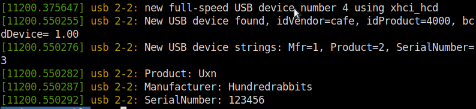
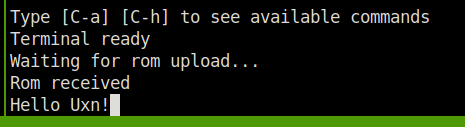

Little experiment to upload a [Uxn](https://wiki.xxiivv.com/site/uxn.html) rom to a Raspberry Pi Pico microcontroller over USB, using the [dfu](https://en.wikipedia.org/wiki/USB#Device_Firmware_Upgrade_mechanism) protocol. It should be easily portable to other microcontrollers since it uses the tinyusb library. (supported MCUs [here](https://github.com/hathach/tinyusb)). Look at this [commit](https://github.com/max22-/uxn-dfu/commit/4b99d274a8acafcf8ade895e18acb413666ae8ca) if you want to do the same.

I have merged [dfu](https://github.com/hathach/tinyusb/tree/master/examples/device/dfu/src) example from tinyusb, and [uxncli](https://git.sr.ht/~rabbits/uxn/tree/main/item/src/uxncli.c).

# If you want to try it quickly

Download uxn-dfu.uf2 and console.rom in the release section. Flash uxn-dfu.uf2 on your Raspberry Pi Pico.

Take some time to appreciate the product name and manufacturer by doing :

```
sudo dmesg
```



Then :

```
sudo apt install dfu-util
sudo dfu-util -d cafe -a 0 -D console.rom
```

Attach a serial to usb converter to the pico uart pins to be able to interact with the console device. (I don't know if it's possible to use dfu and serial over usb at the same time).



# Building 

Make sure you have installed the Raspberry Pi Pico sdk.

```
wget https://github.com/max22-/uxn-dfu
cd uxn-dfu
mkdir build
cd build
cmake ..
make
```


# Warning
The uploaded rom is stored in the ram, not in flash memory.
It would be also possible to dump the rom from the microcontroller, but i've not implemented it.
